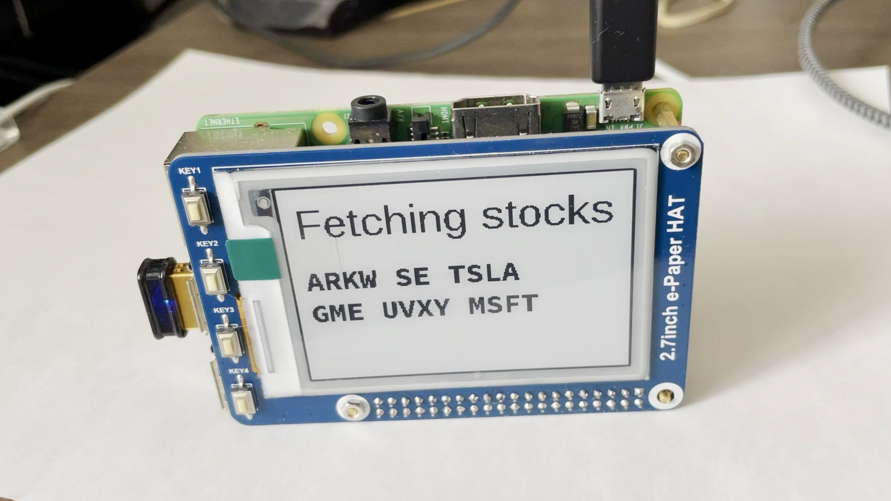
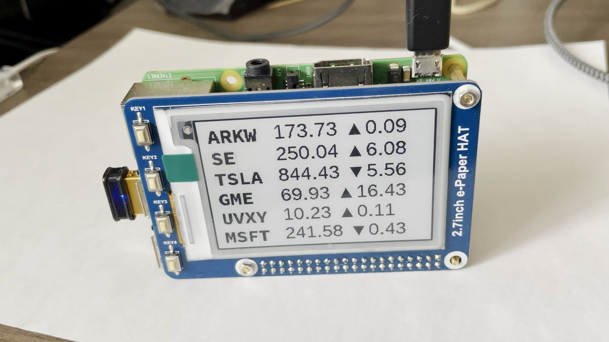
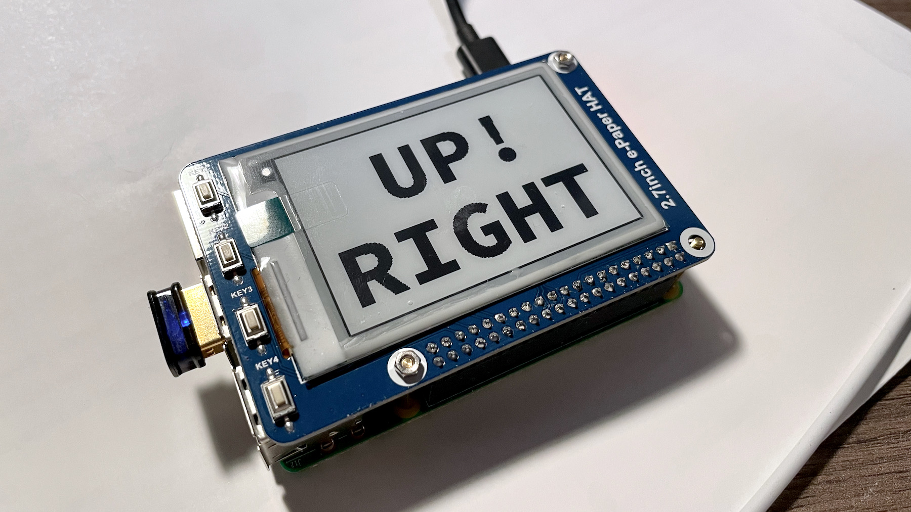
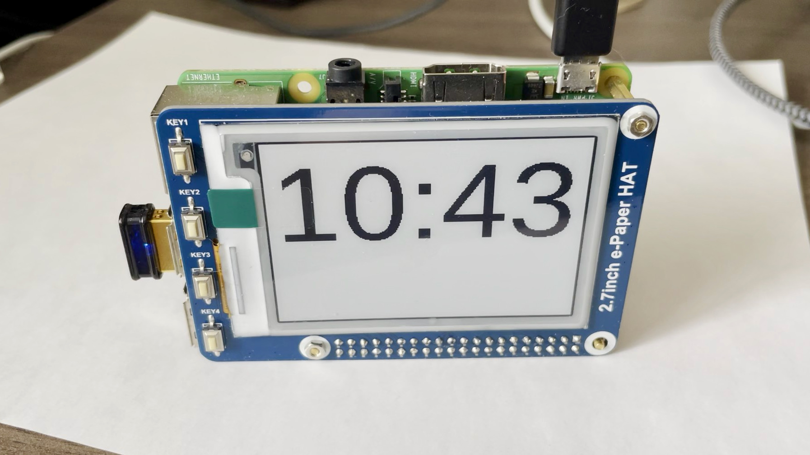

# About "TPS-EPD"

"TPS" stands for "two point seven", corresponding to the 2.7 screen size. "EPD" means "e-paper display".

This repo contains the code for controling a small Raspberry Pi hat.

# About the EPD Hat

I bought it on [Amazon](https://www.amazon.com/gp/product/B075FQKSZ9/ref=ppx_yo_dt_b_asin_title_o02_s00?ie=UTF8&psc=1).

Basically, it is plug-and-play. In addition, it has 4 buttons on the PCB, which are convenient for user input.

It has been working for several months, without any issue. I think it is durable enough.

# Development Reources

- [HAT Wiki](https://www.waveshare.com/wiki/2.7inch_e-Paper_HAT_(B))
- [User Manual](https://www.waveshare.com/w/upload/3/32/2.7inch-e-paper-hat-b-user-manual-en.pdf)
- [Example Code](https://github.com/waveshare/e-Paper/blob/master/RaspberryPi_JetsonNano/python/examples/epd_2in7b_V2_test.py)

# How to Run

Dependencies: `pillow`, `RPi.GPIO`.

To run: `python tps_epd_node_main.py`

# Apps

So far I implemented several apps, listed below. They are switched by buttons.

## Stock Price Board

The first application is a board showing the designated stock prices. I use Yahoo Finance API to get the latest stock price quote. Then I format everything onto the screen.

Fetching stock price quotes:

Showing stock price:

### Yahoo Finance Module

I use this library and it works great: https://github.com/ranaroussi/yfinance

Useful fields in `info` variable: `open, previousClose, regularMarketOpen, regularMarketDayHigh, regularMarketDayLow, regularMarketPrice`.

## Sitting Posture Reminder

Sometimes I slouch after sitting for too long. The solution is to refresh the display temporarily showing "UP RIGHT!" for 5 seconds to remind me the posture. Then I can sit up right to protect my spine.

This app is simple. There is an update timer, which triggers the refresh every 5 minutes.

This app works together with the aforementioned stock board.

## Clock App

My second app is a simple clock. What makes it special is that the time is refreshed every 3 minutes instead of 1 minutes. I don't need it to be precise.

Simple clock effect:

